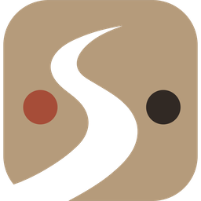

<div align="center">
  

  # TrackFlow

  **Automatic time tracking for people who bill by the client.**

  [](LICENSE.txt)
  [](#)
  [](https://github.com/CODEX-cpp/TrackFlow/releases/latest)
  [](https://activitywatch.net/)
</div>

---

TrackFlow watches what you actually work on — apps, active windows, VPN sessions, VoiSpeed calls, Excel files, Claude Code sessions, periodic screenshots — and turns it into a daily timeline, at-a-glance Home modules, and per-client projects with their own stopwatch. No manual timers, no "did I remember to log that."

It was built around one recurring, mundane problem: **which client was I actually working for, and for how long?** A VPN session maps to a client. An Excel file maps to a client. A project maps to a client with an hour budget and overrun alerts. Everything ends up on one timeline instead of scattered across memory, spreadsheets, and VPN client logs.

It's a fork of [ActivityWatch](https://activitywatch.net/), rewritten almost entirely: the original Python backend (server, watchers, `aw-notify`) has been replaced with a single Rust process embedded in [Tauri](https://tauri.app/) — no external server, no open network port, everything runs in-process inside the app — and the web UI has been heavily redesigned on top of the original Vue 2 base.

**TrackFlow is not affiliated with the main ActivityWatch project.** It follows the official forking requirements ([docs.activitywatch.net/en/latest/forking.html](https://docs.activitywatch.net/en/latest/forking.html)): its own name and logo, no association with the original project, same license (MPL-2.0), public source code.

## Key features

- 📅 **Daily timeline** with lanes for apps, VPN, Claude Code, VS Code, Excel, VoiSpeed, browser
- 🧩 **Reorderable home modules** — top apps, top window titles, Claude usage, and more
- 🏷️ **App→category tagging**, assignable by hand or automatically by an AI agent (Claude)
- ⏱️ **Projects** with start/pause stopwatch, hour budgets, deadlines and overrun alerts
- 🔔 **Custom notifications** — configurable rules by category/app/project/idle time/VPN, delivered as native Windows notifications
- 👀 **Dedicated watchers**: active window, idle (AFK), VPN sessions (OpenVPN Connect + ZyWALL SecuExtender), VoiSpeed, Claude Code, VS Code, Excel, periodic screenshots, app icons
- 🔒 **Configurable privacy filters** — drop or redact sensitive data before it's ever written to disk
- 💬 **Chat with an AI agent** (Claude) that answers questions about your own activity data
- 🔄 **Self-updating** — checks for new releases on startup, downloads and verifies them (digital signature) in the background, and prompts to restart when ready; can be switched to a manual "click to update" mode from Settings

## Tech stack

- **Frontend**: Vue 2 + TypeScript + Pinia + Vite
- **Backend/shell**: Rust + [Tauri 2](https://tauri.app/) — a single process, with the ActivityWatch server (`aw-server-rust`, vendored with local patches) embedded in-process, no networking
- **Watchers**: each a small, independent Rust binary, launched as a Tauri sidecar and communicating over stdout/JSON
- **Windows only** for now (watchers rely directly on Win32 APIs for most of their functionality)

## Building from source

### Prerequisites

- [Node.js](https://nodejs.org/) 18+ and npm
- [Rust](https://rustup.rs/) (stable toolchain) + the MSVC target on Windows
- [Tauri CLI](https://v2.tauri.app/start/prerequisites/) (installed automatically as an npm dependency, see `package.json`)

### Development

```bash
npm install
npx tauri dev
```

Starts the frontend (Vite, hot reload) and the Tauri app together, pointed at the dev server.

### Production build

```bash
npm run build            # builds the frontend into dist/
cargo build --release --manifest-path src-tauri/Cargo.toml   # builds app.exe + the watcher sidecars
```

Packaging into an installable `.exe` is **not** done with Tauri's own bundler — TrackFlow ships a self-update system (see below) that needs a specific on-disk layout, so it uses a hand-written NSIS script instead:

```bash
makensis /DVERSION=<version> installer/trackflow-installer.nsi
```

This produces `trackflow-setup-<version>.exe`, which installs `app.exe` and the watchers into a versioned folder (`versions/<version>/`) alongside a small stable `launcher.exe` — the piece every shortcut actually points to, so an update can be downloaded into its own new folder without ever touching a running instance.

### Other useful commands

```bash
npm run serve   # frontend only, in the browser (no Tauri shell/real data)
npm run lint    # ESLint over src/ and test/
```

## Project structure

```
src/                        web UI (Vue 2 + TypeScript + Pinia)
src-tauri/                  Tauri shell (Rust) — commands, tray, notifications, in-process server, updater
launcher/                   tiny stable entry point (see "Production build" above)
installer/                  hand-written NSIS installer script
aw-server-rust-src/         vendored ActivityWatch server, with local patches (see comments in the code)
aw-watcher-*-rust/          independent watchers (VPN, AFK, window, VoiSpeed, screenshots, etc.)
```

## License

[Mozilla Public License 2.0](LICENSE.txt) — same license as the original [ActivityWatch](https://github.com/ActivityWatch/activitywatch) project.
